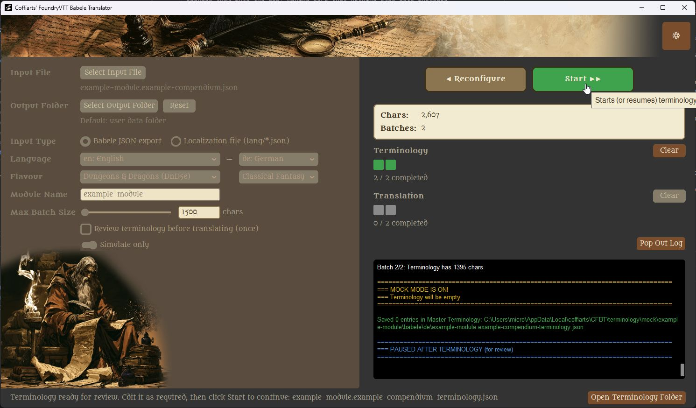
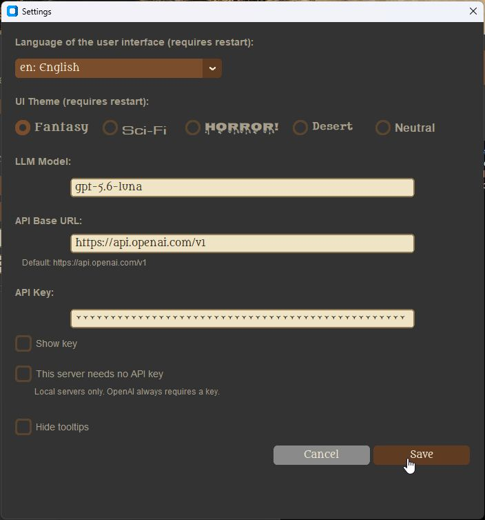

# Coffiarts' Translator for Foundry VTT (CFBT)

Tired of desperately wanting to play your favourite Foundry VTT adventure module, only to find it's
just not available in your language? And translating it yourself by hand feels tedious, if not
downright impossible for a large compendium?


CFBT is a free, open-source desktop tool that translates [Babele](https://foundryvtt.com/packages/babele/)-compatible
compendium exports for [Foundry Virtual Tabletop](https://foundryvtt.com/) into other languages, using an LLM
(e.g. OpenAI, or your own local/remote model server) to do the actual translation work.



## What CFBT is:
A guided, review-friendly workflow around an LLM translation call — terminology extraction first,
then translation, with a pause-and-edit step in between, plus a themeable UI in English and several other languages.

## What CFBT is not:
It does not include, generate, or supply any game content of its own, and it is not a
translation service — you bring your own source files and your own LLM access.

## Why use this tool then?

If all the translation is done by AI anyway, why not just use DeepL, ChatGPT, or Copilot directly?

Because reliably translating a large, structured compendium is a different problem than translating chat text.
Free/chat-based AI tools aren't built for the consistent, robust batch handling this requires — things like
protecting technical labels and Foundry-specific syntax from being mistranslated, respecting provider rate/size
limits, and recovering cleanly from unpredictable AI hiccups. See *Advanced Features* below for the details.

## What's free:
CFBT itself, fully — the application, its source code, and its UI.

## What's not free:
Using a remote LLM provider (e.g. OpenAI) incurs that provider's own API costs; running a
local model server is free but requires your own hardware/setup.

> Before going further, please read the [Disclaimer](docs/DISCLAIMER.md) — in short, you are responsible for
> having the rights to translate whatever content you feed into CFBT. Third-party licenses for bundled fonts
> and packages are listed in [Third-Party Notices](docs/THIRD_PARTY_NOTICES.md).

Don't get overwhelmed — it may sound technical, but it's easier than you think. You just need to understand a
few basics, explained below:

- **What [Babele](https://foundryvtt.com/packages/babele/) does** and why you need this free Foundry module
  installed to actually see translated content in your game.
- **What an "LLM" is**, why CFBT needs one, and how to get an API key for a provider like OpenAI.
- **How it all fits together** to get your module translated, step by step.

### As for cost ..
As a rough orientation, translating a fairly large compendium (around 1.2 million characters) via
OpenAI cost around 4-5 USD in my own experience — money I consider well spent. This is just anecdotal, not a
guarantee, but as long as you use the tool reasonably, the cost shouldn't be a concern.

## Getting Started

Here's the whole journey from zero to a translated module, in order:

1. **Install [Babele](https://foundryvtt.com/packages/babele/)** into your Foundry VTT installation — it's a free
   module, and the piece that actually displays translated content in your game.
2. **Export the compendium you want translated** as a Babele JSON file — this is the "translatable" that CFBT will
   work on. See Babele's own documentation (linked above) for how to do this.
3. **Install CFBT** — see *Requirements & Installation* below.
4. **Choose an LLM provider and get an API key** — e.g. for OpenAI, create one at
   [platform.openai.com/api-keys](https://platform.openai.com/api-keys). (You can also point CFBT at a local/self-hosted
   model server instead — see *Advanced Features*.)
5. **Start CFBT** and follow the detailed steps below: register your API key in Settings, pick your translatable
   input file and output folder, run the translation, and reintegrate the result back into Foundry.

## Requirements & Installation

- **Windows 10/11 (64-bit)** — no Python installation needed. CFBT *should* also run on Linux and macOS from
  source, though this hasn't been tested yet — feedback on that is warmly welcome!
- Download the latest release `.zip` from the [GitHub Releases page](../../releases), and extract it anywhere on
  your system. There's no installer, and nothing is written to the Windows registry.
- Run `cfbt.exe` from the extracted folder to start CFBT.

To uninstall, simply delete the extracted folder (your settings and API key are stored separately in your user
profile, so they won't be removed with it). If you'd rather run CFBT from Python source instead of the packaged
build, see *Advanced Features* below.

## Detailed Usage

### What to expect: a simple example

Before diving into the details, here's what CFBT actually does to your data — a minimal before/after example
(English → French):

**Input** (excerpt from a Babele-exported compendium):
```json
TODO: paste a minimal real input excerpt here
```

**Output** (after CFBT translates it):
```json
TODO: paste the matching translated excerpt here
```

### 1. Configure Settings

Open **Settings** from the main window to configure:

- **UI Language** and **UI Theme** — changing either prompts a restart to apply.
- **LLM Model** and **API Base URL** — defaults to OpenAI; point this at a different provider or your own
  local/remote model server instead.
- **API Key** — required for most providers; toggle **"No key needed"** if you're running a local server that
  doesn't require one.


