# Coffiarts' Translator for Foundry VTT (CFBT)


 
[](https://github.com/coffiarts/FoundryVTT-crunch-my-party/issues?label=Open+Bugs)

Tired of desperately wanting to play your favourite Foundry VTT adventure module, only to find it's
just not available in your language? And translating it yourself by hand feels tedious, if not
downright impossible for a large compendium?


CFBT is a free, open-source desktop tool that translates [Babele](https://foundryvtt.com/packages/babele/)-compatible
compendium exports — or a Foundry module's own localization files — into other languages, using an LLM of your choice
(e.g. OpenAI, or your own local/remote model server) to do the actual translation work.

**Two independent modes:**
- **Translating a compendium?** → you'll need [Babele](https://foundryvtt.com/packages/babele/) installed in Foundry to actually see the translated content in-game.
- **Translating a module's own UI text instead** (`lang/*.json`)? → no Babele involved at all — CFBT handles Foundry's native localization files directly.

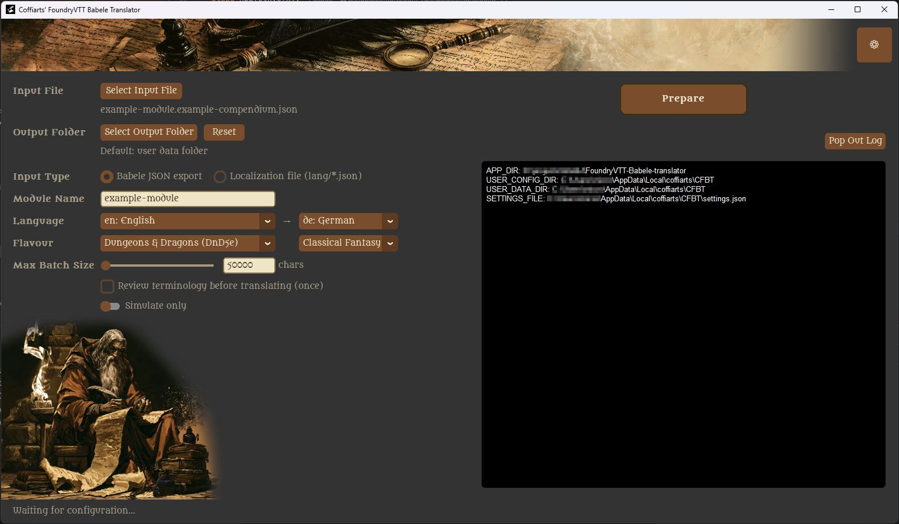

## Support This Project

CFBT is free and always will be. If it saved you time (or your sanity), consider buying my Babelfish some food 🐠

[](https://ko-fi.com/coffiarts) &nbsp;
[](https://github.com/sponsors/coffiarts)

No obligation, no perks, no strings attached — just a nice gesture if it made your life easier.


## Table of Contents

- [What CFBT is](#what-cfbt-is)
- [What CFBT is not](#what-cfbt-is-not)
- [Why use this tool then?](#why-use-this-tool-then)
- [What's free](#whats-free)
- [What's not free](#whats-not-free)
- [Getting Started](#getting-started)
- [Requirements & Installation](#requirements--installation)
- [Choose Your UI Theme](#choose-your-ui-theme)
- [Detailed Usage](#detailed-usage)
  - [What to expect: a simple example](#what-to-expect-a-simple-example)
  - [1. Configure Settings](#1-configure-settings)
  - [2. Select Input, Output, and Module Name](#2-select-input-output-and-module-name)
  - [3. Set the Translation Context](#3-set-the-translation-context)
  - [4. Max Batch Size](#4-max-batch-size)
  - [5. (Optional) Review Terminology Before Translating](#5-optional-review-terminology-before-translating)
  - [6. (Optional) Simulate Only](#6-optional-simulate-only)
  - [7. Preparation](#7-preparation)
  - [8. Run Translation](#8-run-translation)
  - [9. Resuming an Incomplete Translation](#9-resuming-an-incomplete-translation)
  - [10. Monitor Progress](#10-monitor-progress)
  - [11. Handling Placeholder Integrity Errors & Review Items](#11-handling-placeholder-integrity-errors--review-items)
  - [12. Reintegrating the Result into Foundry VTT](#12-reintegrating-the-result-into-foundry-vtt)
- [A General Note on Translation Quality](#a-general-note-on-translation-quality)
- [Advanced Features](#advanced-features)
  - [Using a Local LLM Server (e.g. Ollama)](#using-a-local-llm-server-eg-ollama)
  - [Running CFBT from Source](#running-cfbt-from-source)
  - [Tweaking Translatable Fields & Containers](#tweaking-translatable-fields--containers)
  - [Tweaking Prompt Instructions](#tweaking-prompt-instructions)
  - [Building Your Own Package](#building-your-own-package)
- [Development Notes](#development-notes)


## What CFBT is:
A guided, review-friendly workflow around an LLM translation call — terminology extraction first,
then translation, with a pause-and-edit step in between, plus a themeable UI in English and several other languages.

## What CFBT is not:
It does not include, generate, or supply any game content of its own, and it is not a
translation service — you bring your own source files and your own LLM access.

## Why use this tool then?

If all the translation is done by AI anyway, why not just use DeepL, ChatGPT, or Copilot directly?

Because reliably translating a large, structured compendium is a different problem than translating chat text.
Free/chat-based AI tools aren't built for the consistent, robust batch handling this requires — things like
protecting technical labels and Foundry-specific syntax from being mistranslated, respecting provider rate/size
limits, and recovering cleanly from unpredictable AI hiccups. See [Advanced Features](#advanced-features) below for the details.

## What's free:
CFBT itself, fully — the application, its source code, and its UI.

## What's not free:
Using a remote LLM provider (e.g. OpenAI) incurs that provider's own API costs; running a
local model server is free but requires your own hardware/setup.

> CFBT is released under the [MIT License](LICENSE). Before going further, please read the
> [Disclaimer](docs/DISCLAIMER.md) — in short, you are responsible for having the rights to translate whatever
> content you feed into CFBT. Third-party licenses for bundled fonts and packages are listed in
> [Third-Party Notices](docs/THIRD_PARTY_NOTICES.md).

Don't get overwhelmed — it may sound technical, but it's easier than you think. You just need to understand a
few basics, explained below:

- **What [Babele](https://foundryvtt.com/packages/babele/) does** and why you need this free Foundry module
  installed to actually see translated content in your game.
- **What an "LLM" is**, why CFBT needs one, and how to get an API key for a provider like OpenAI.
- **How it all fits together** to get your module translated, step by step.

### As for cost ..
As a rough orientation, translating a fairly large compendium (around 1.2 million characters) via
OpenAI cost around 4-5 USD in my own experience — money I consider well spent. This is just anecdotal, not a
guarantee, but as long as you use the tool reasonably, the cost shouldn't be a concern.

## Getting Started

Here's the whole journey from zero to a translated module, in order:

1. **If you're translating a Babele compendium export**, install [Babele](https://foundryvtt.com/packages/babele/) into your Foundry VTT installation first — it's a free module, and the piece that actually displays translated content in your game. (Skip this step if you're translating only your module's own localization file instead — no Babele needed.)
2. **Export the compendium you want translated** as a Babele JSON file — this is the "translatable" that CFBT will
   work on. See Babele's own documentation (linked above) for how to do this.
3. **Install CFBT** — see [Requirements & Installation](#requirements--installation) below.
4. **Choose an LLM provider and get an API key** — e.g. for OpenAI, create one at
   [platform.openai.com/api-keys](https://platform.openai.com/api-keys). (You can also point CFBT at a local/self-hosted
   model server instead — see [Advanced Features](#advanced-features) .)
5. **Start CFBT** and follow the detailed steps below: register your API key in Settings, pick your translatable
   input file and output folder, run the translation, and reintegrate the result back into Foundry.

## Requirements & Installation

- **Windows 10/11 (64-bit)** — no Python installation needed. CFBT *should* also run on Linux and macOS from
  source, though this hasn't been tested yet — feedback on that is warmly welcome!
- Download file **[cfbt.zip](https://github.com/coffiarts/FoundryVTT-Babele-translator/releases/download/latest/cfbt.zip)** from the [latest release on GitHub](https://github.com/coffiarts/FoundryVTT-Babele-translator/releases/tag/latest)
- extract it anywhere on your system. There's no installer, and nothing is written to the Windows registry.
- Run `cfbt.exe` from the extracted folder to start CFBT.

To uninstall, simply delete the extracted folder (your settings and API key are stored separately in your user
profile, so they won't be removed with it). If you'd rather run CFBT from Python source instead of the packaged
build, see [Advanced Features](#advanced-features)  below.

## Choose Your UI Theme!

CFBT ships with four built-in themes, each with its own fonts, colors, and banner artwork. Pick one in
**Settings** (see step 1) — switching prompts a quick restart to apply.

| Fantasy (default) | Sci-Fi | Horror | Desert | Neutral |
|---|---|---|---|---|
|  | 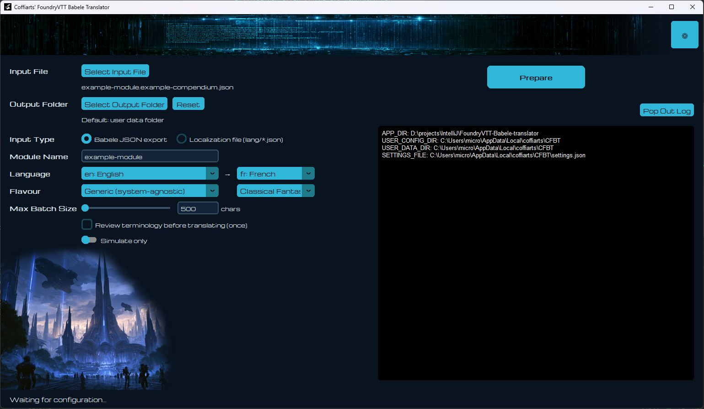 | 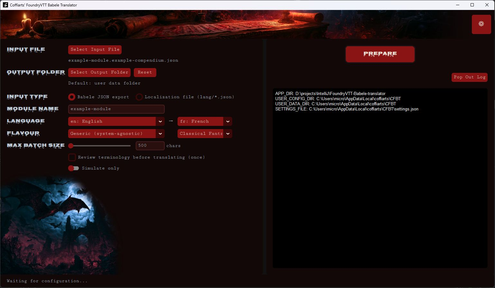 | 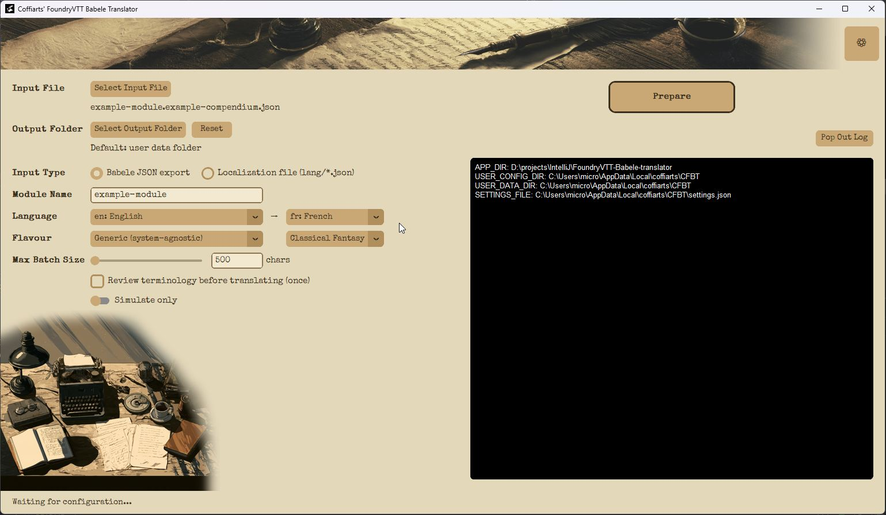 | 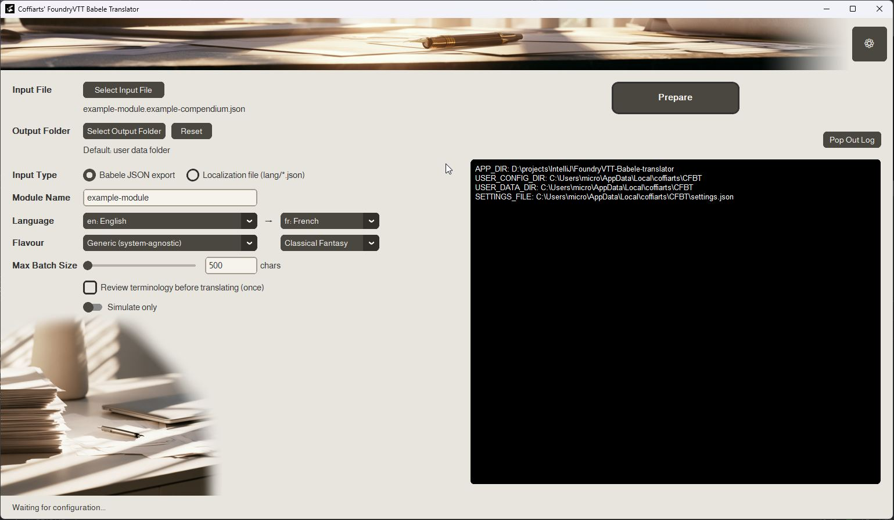 |

## Detailed Usage

### What to expect: a simple example

Before diving into the details, here's what CFBT actually does to your data — a minimal before/after example
(English → French):

**Input** (excerpt from a Babele-exported compendium in ENGLISH):
```json
{
  "label": "Shadows Over Duskmere",
  "aaa": "...",
  "entries": {
    "bbb": "...",
    "Shadows Over Duskmere": {
      "name": "Shadows Over Duskmere",
      "description": "<p>See the <a href=\"https://example.com/notes\">campaign notes</a> for ongoing updates.</p><aside class=\"notable\"><p>The village of Duskmere has always kept its secrets close, but lately something darker stirs beneath its cobbled streets. Strangers have vanished without a trace, and the villagers whisper of a cult gathering strength in the old cairn outside town. It falls to the party to uncover what's really happening, before Duskmere loses more than it can bear.</p></aside><p>",
      "folders": {
        "Prologue": "Prologue",
        "Part One: The Vanishing": "Part One: The Vanishing",
        "Part Two: Beneath the Stones": "Part Two: Beneath the Stones",
        "Part Three: The Ashen Circle": "Part Three: The Ashen Circle",
        "Epilogue": "Epilogue",
        "NPC Portraits": "NPC Portraits",
        "Hazards & Traps": "Hazards & Traps",
        "Starting Notes": "Starting Notes"
      },
      "drawings": {
        "signpost-01": "The Hollow Cairn — turn back if you value your life.",
        "warning-glyph-02": "Trespassers will be forgotten."
      },
      "journals": {
        "Whispers Beneath Duskmere": {
          "name": "Whispers Beneath Duskmere",
          "pages": {
            "Rumors and Leads": {
              "name": "Rumors and Leads",
              "caption": "A hand-drawn sketch of the village square, pinned to the tavern notice board.",
              "text": "Most of the villagers are preoccupied with the Ashen Circle, however, and no one in town knows the exact location of the Hollow Cairn's entrance; however, @UUID[JournalEntry.dmerVillageNPC.JournalEntryPage.b7C88GIRhkdsryPU]{Maren Thistledown} and @UUID[JournalEntry.dmerVillageNPC.JournalEntryPage.XGCTPZoAabSMFPsv]{Corvin Ashgate} can offer suggestions on how the party might find someone who knows the way. If asked directly, Maren will only agree to talk after a successful [[/r 1d20 + 2]]{Persuasion Check} against her natural suspicion of outsiders. Corvin, if convinced to join the search, fights using [[/r 2d6 + 3]]{his old guard-captain's blade} whenever the party is ambushed along the trail."
            }
          }
        }
      }
    },
    "ccc": "..."
  }
}
```

**Output** (after CFBT translates it to FRENCH):

Note how both the JSON structure with its node and label names, as well as Foundry-specific Macro Code (lower block) is preserved!

```json
{
  "label": "Ombres sur Duskmere",
  "aaa": "...",
  "entries": {
    "bbb": "...",
    "Shadows Over Duskmere": {
      "name": "Ombres sur Duskmere",
      "description": "<p>Consulte les <a href=\"https://example.com/notes\">notes de campagne</a> pour connaître les mises à jour régulières.</p><aside class=\"notable\"><p>Le village de Duskmere a toujours gardé ses secrets bien à l'abri, mais dernièrement, quelque chose de plus sombre s'agite sous ses rues pavées. Des inconnus ont disparu sans laisser de traces, et les villageois murmurent qu'un culte gagne en puissance dans le vieux cairn à l'extérieur du village. C'est au groupe d'aventuriers de découvrir ce qui se passe réellement, avant que Duskmere ne perde plus qu'il ne peut le supporter.</p></aside><p>",
      "folders": {
        "Prologue": "Prologue",
        "Part One: The Vanishing": "Première partie : Les disparitions",
        "Part Two: Beneath the Stones": "Deuxième partie : Sous les pierres",
        "Part Three: The Ashen Circle": "Troisième partie : le Cercle cendré",
        "Epilogue": "Épilogue",
        "NPC Portraits": "Portraits de PNJ",
        "Hazards & Traps": "Dangers et pièges",
        "Starting Notes": "Notes de départ"
      },
      "drawings": {
        "signpost-01": "Le Cairn creux — rebrousse chemin si tu tiens à la vie.",
        "warning-glyph-02": "Les intrus seront oubliés."
      },
      "journals": {
        "Whispers Beneath Duskmere": {
          "name": "Murmures sous Duskmere",
          "pages": {
            "Rumors and Leads": {
              "name": "Rumeurs et pistes",
              "caption": "Un croquis dessiné à la main de la place du village, épinglé au tableau d’affichage de la taverne.",
              "text": "La plupart des villageois sont toutefois préoccupés par le Cercle cendré, et personne au village ne connaît l’emplacement exact de l’entrée du Cairn creux ; cependant, @UUID[JournalEntry.dmerVillageNPC.JournalEntryPage.b7C88GIRhkdsryPU]{Maren Thistledown} et @UUID[JournalEntry.dmerVillageNPC.JournalEntryPage.XGCTPZoAabSMFPsv]{Corvin Ashgate} peuvent suggérer comment le groupe d’aventuriers pourrait trouver quelqu’un qui connaît le chemin. Si on lui pose directement la question, Maren n’acceptera de parler qu’après un [[/r 1d20 + 2]]{test de Persuasion} réussi contre sa méfiance naturelle envers les étrangers. Corvin, s’il est convaincu de se joindre aux recherches, se bat avec [[/r 2d6 + 3]]{sa vieille lame de capitaine de la garde} chaque fois que le groupe d’aventuriers tombe dans une embuscade le long du sentier."
            }
          }
        }
      }
    },
    "ccc": "..."
  }
}
```
**Output** (after CFBT translates it to GERMAN):

Note how both the JSON structure with its node and label names, as well as Foundry-specific Macro Code (lower block) is preserved!

```json
{
  "label": "Schatten über Duskmere",
  "aaa": "...",
  "entries": {
    "bbb": "...",
    "Shadows Over Duskmere": {
      "name": "Schatten über Duskmere",
      "description": "<p>Sieh in den <a href=\"https://example.com/notes\">Kampagnenotizen</a> nach, um laufende Aktualisierungen zu erhalten.</p><aside class=\"notable\"><p>Das Dorf Duskmere hat seine Geheimnisse schon immer für sich behalten, doch seit Kurzem regt sich etwas Dunkleres unter seinen kopfsteingepflasterten Straßen. Fremde sind spurlos verschwunden, und die Dorfbewohner flüstern von einem Kult, der im alten Steinhügel außerhalb des Ortes an Stärke gewinnt. Es liegt an der Abenteurergruppe, herauszufinden, was wirklich geschieht, bevor Duskmere mehr verliert, als es verkraften kann.</p></aside><p>",
      "folders": {
        "Prologue": "Prolog",
        "Part One: The Vanishing": "Teil Eins: Das Verschwinden",
        "Part Two: Beneath the Stones": "Teil Zwei: Unter den Steinen",
        "Part Three: The Ashen Circle": "Teil Drei: The Ashen Circle",
        "Epilogue": "Epilog",
        "NPC Portraits": "NSC-Porträts",
        "Hazards & Traps": "Gefahren und Fallen",
        "Starting Notes": "Startnotizen"
      },
      "drawings": {
        "signpost-01": "Der hohle Steinhügel – kehr um, wenn dir dein Leben lieb ist.",
        "warning-glyph-02": "Eindringlinge geraten in Vergessenheit."
      },
      "journals": {
        "Whispers Beneath Duskmere": {
          "name": "Geflüster unter Duskmere",
          "pages": {
            "Rumors and Leads": {
              "name": "Gerüchte und Hinweise",
              "caption": "Eine handgezeichnete Skizze des Dorfplatzes, die am Anschlagbrett der Taverne befestigt ist.",
              "text": "Die meisten Dorfbewohner sind allerdings mit dem Ashen Circle beschäftigt, und niemand im Ort kennt die genaue Lage des Eingangs zum Hollow Cairn; allerdings können @UUID[JournalEntry.dmerVillageNPC.JournalEntryPage.b7C88GIRhkdsryPU]{Maren Thistledown} und @UUID[JournalEntry.dmerVillageNPC.JournalEntryPage.XGCTPZoAabSMFPsv]{Corvin Ashgate} Vorschläge dazu machen, wie die Abenteurergruppe jemanden finden könnte, der den Weg kennt. Wenn man Maren direkt fragt, stimmt sie einem Gespräch erst nach einer erfolgreichen [[/r 1d20 + 2]]{Überreden-Probe} gegen ihr natürliches Misstrauen gegenüber Außenstehenden zu. Falls Corvin überzeugt wird, sich der Suche anzuschließen, kämpft er immer dann mit [[/r 2d6 + 3]]{seiner alten Klinge als Hauptmann der Wache}, wenn die Abenteurergruppe entlang des Pfades überfallen wird."
            }
          }
        }
      }
    },
    "ccc": "..."
  }
}
```

### 1. Configure Settings

Open **Settings** from the main window to configure:

- **UI Language** and **UI Theme** — changing either prompts a restart to apply.
- **LLM Model** and **API Base URL** — defaults to OpenAI; point this at a different provider or your own
  local/remote model server instead.
- **API Key** — required for most providers; toggle **"No key needed"** if you're running a local server that
  doesn't require one.

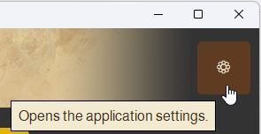


**Choosing a model and provider:** the default works well for most use cases — a solid balance of quality and
cost. If you want to experiment: smaller/cheaper models cut costs further, at some risk to translation quality,
especially for nuanced or idiomatic text; larger/more capable models catch more nuance but cost more per
request. A local/self-hosted OpenAI-compatible server (e.g. Ollama) is free to run but needs your own hardware,
and quality depends entirely on the model you host — worth trying for cost-free experimentation, but review the
results carefully before relying on it for a large compendium.

### 2. Select Input, Output, and Module Name

- **Input File** — pick the file to translate: either a Babele JSON export, or a Foundry localization file
  (`lang/*.json`). The **Input Type** radio buttons tell CFBT which one you're using, since it changes how text
  is extracted and the output is named.
- **Output Folder** — where the translated file and review items are written. Defaults to your user data folder;
  use **Reset** to return to that default at any time.
- **Module Name** — auto-suggested from your input file, but editable. Best practice: name it exactly after the
  module ID of the source Foundry module.

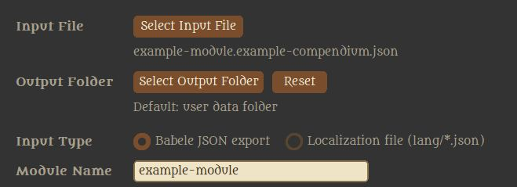

### 3. Set the Translation Context

- **Language** — pick the source and target language for the translation.
- **Flavour** — pick the game system and genre. Both steer the AI's terminology and translation style — e.g.
  picking the right game system helps keep rules-specific terms consistent.

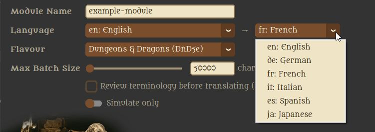
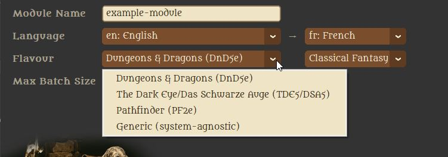
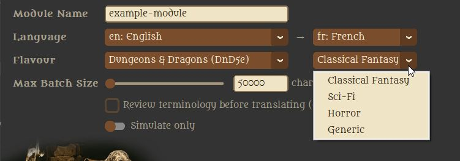

### 4. Max Batch Size

Controls how many characters CFBT packs into a single AI request. This is exactly the "batch handling" mentioned
earlier in *Why use this tool then?* — getting it right matters for both cost and reliability:

- **Larger batches** mean fewer AI requests (faster overall, sometimes cheaper), but risk hitting your provider's
  per-request size/rate limits, and a failed batch means retrying more work at once.
- **Smaller batches** are more failsafe (fewer retries if something goes wrong), but cause more overhead and a
  longer total processing time.

The default works well for most compendiums. If a single translatable entry (e.g. one very long description) is
itself larger than the configured Max Batch Size, CFBT stops with an error telling you exactly which entry it
was and how large — simply raise the Max Batch Size and click **Prepare** again.


### 5. (Optional) Review Terminology Before Translating

Enable **"Review terminology before translating (once)"** before starting. CFBT will then stop right after
building the terminology list, letting you review and edit it by hand — useful for locking in consistent
names/terms before the (usually much larger) translation pass begins. Click **Start** again to continue once
you're happy with it. This option auto-disables itself after each run, so re-enable it whenever you start a new
input file.

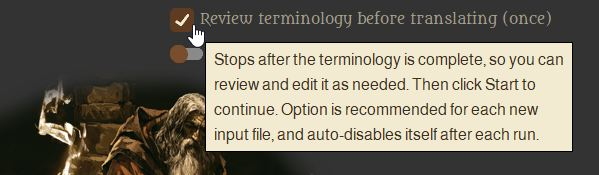

### 6. (Optional) Simulate Only

Toggle **"Simulate only"** to do a full dry run: CFBT walks through the whole workflow without making any real AI
requests, so nothing is actually translated and no cost is incurred. Progress from simulated runs is kept
separate from real ones, so you can safely try things out first, then turn it off before a real run. Note: this
setting isn't remembered between sessions — it always starts off, so you never accidentally leave it on.


### 7. Preparation

Click **Prepare** — this is the offline part: CFBT validates your input file, extracts the translatable text
segments, and builds the batch plan. No AI calls happen yet. Once it succeeds, the button becomes **Start**,
ready for the next step.

If CFBT finds saved progress for this exact input file, it resumes from there. If your settings (or the input
file's content) changed since that progress was saved, you'll be asked whether to discard it and start fresh, or
keep it and restore your previous settings first — see *Resuming an Incomplete Translation* below.

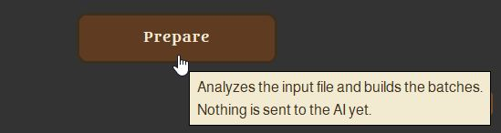
A **successful preparation result** looks like this (all batches defined, no saved progress, ready to start!):
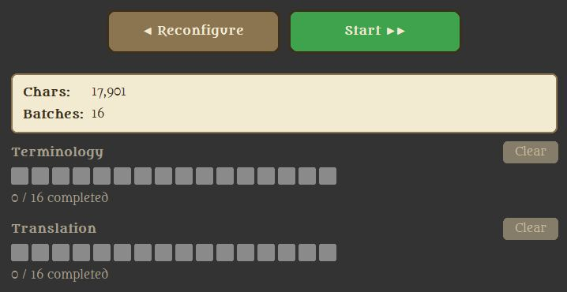

### 8. Run Translation

Click **Start** (see above) to begin the actual AI-driven work. CFBT first builds the terminology (a glossary of key terms,
via the LLM), then uses it to translate:

- **Without** "Review terminology before translating" (step 5): runs straight through, terminology then
  translation, without stopping.
- **With** it enabled: CFBT stops right after terminology is built, letting you review and edit it:<br/><br>
  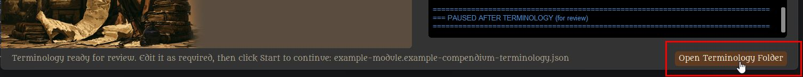<br/><br/>
  Example of an automatically extracted English => French terminology. Edit this in the text editor of your choice and save it in place before continuing:<br/><br>
  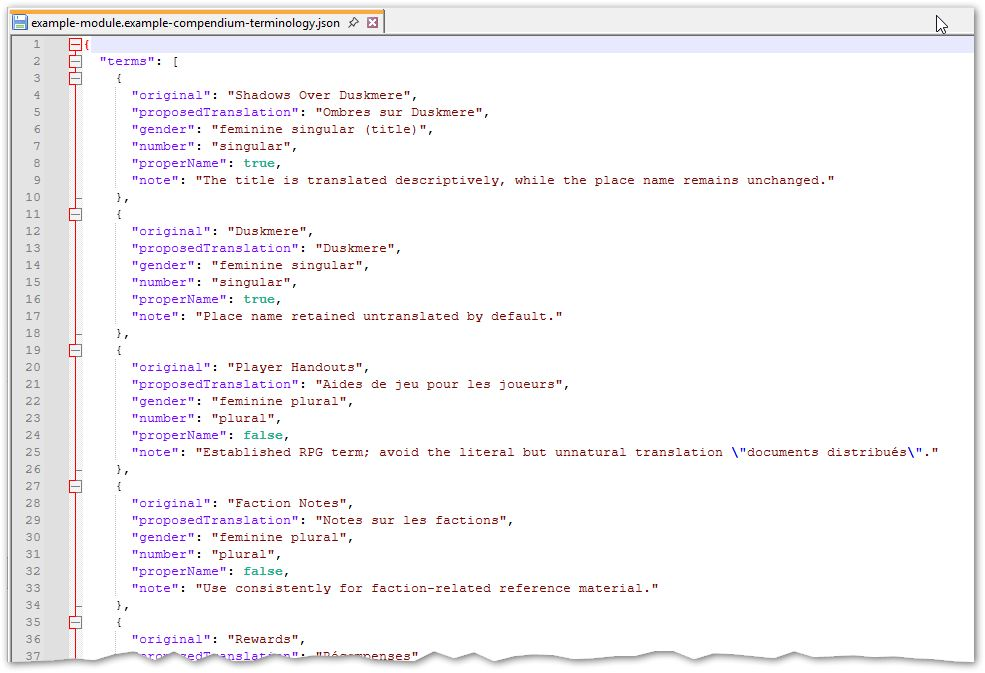

- click
  **Start** again to continue into the actual translation.

While running, the main button turns into **Cancel** — safe to use at any point, since progress is saved
continuously. See *Resuming an Incomplete Translation* below for what happens next if you do.

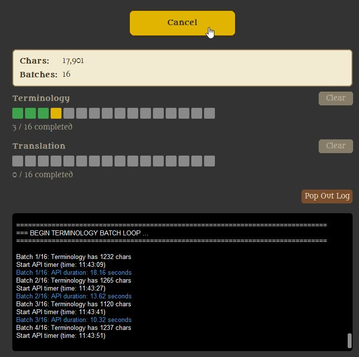

After clicking **Cancel** the batch that's currently being worked on will be completed first, so you might have to wait a few seconds, or in case of large batches, even a couple of minutes, before the view returns to step 7. (Preparation)


### 9. Resuming an Incomplete Translation

If a run was cancelled, or CFBT was closed before finishing, nothing is lost. Reopen CFBT with the same input
file and click **Prepare** — it detects the saved progress and lets you continue with **Start** instead of
starting over. If anything relevant changed in the meantime (settings, or the input file itself), CFBT tells you
exactly what changed and asks whether to discard the old progress or keep it.

### 10. Monitor Progress

While running, the main window shows:
- **Stats** — character count and batch count, plus a highlighted


    (!) Note:
    Character count here reflects only the condensed char count of all the translatable
    text chunks extracted from the source file. Don't worry if this count should be 
    significantly smaller than the char count of the original file you might be seeing
    in a  text editor. Imagine it as the "naked" text stripped of all its "clothes" 
    (i.e. all the JSON overhead).


- **Review Items** counter that only appears
  when there's something to look at (click **Show** next to it — more on that in the next step).
- **Progress bars** for Terminology and Translation, each showing "X / Y completed", with a **Clear** option to
  discard that phase's progress if you want to redo it.
- **Log** — detailed step-by-step output; use **Pop Out Log** to view it in its own window.

When a run finishes, CFBT plays a completion sound.

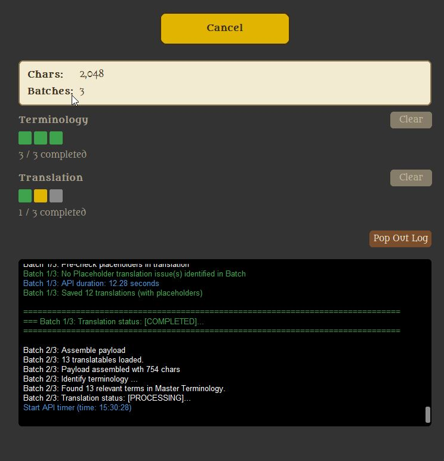

### 11. Handling Placeholder Integrity Errors & Review Items

Protected syntax (`@UUID[...]`, `@Embed[...]`, `@Compendium[...]`, and `[[...]]` inline rolls) is masked with
placeholders before being sent to the AI, so it should survive translation untouched. Occasionally, though, the
AI's response drops or mangles a placeholder anyway. When that happens, CFBT doesn't silently ignore it — it
pauses that batch and asks you what to do:

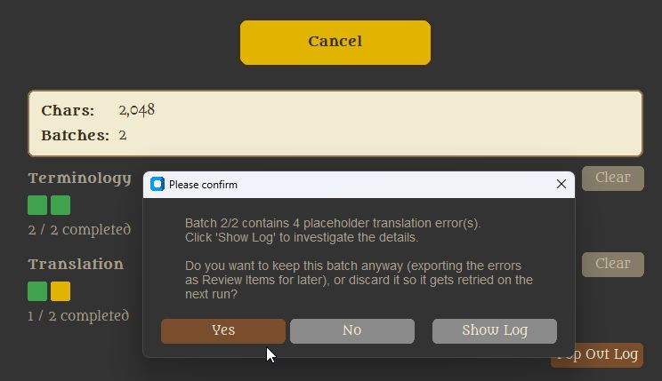

- **Keep it** — the batch is accepted as-is, and the affected entries are exported as **Review Items** for you to
  fix by hand afterward.
- **Discard it** — the batch is thrown away and retried from scratch on the next run.

Kept review items show up as a highlighted counter in the stats box — click **Show** to open them:

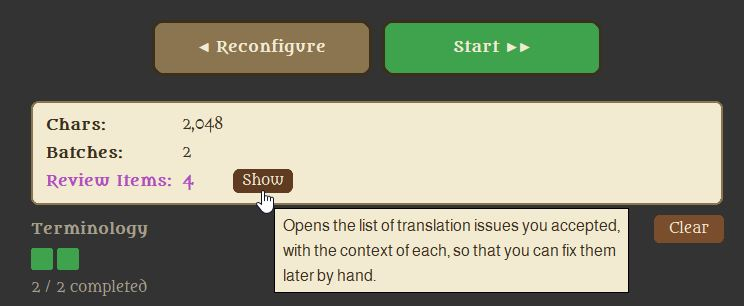

The detail view shows exactly where the placeholder sat in the original text, and what the AI's translation
looks like around the same spot:

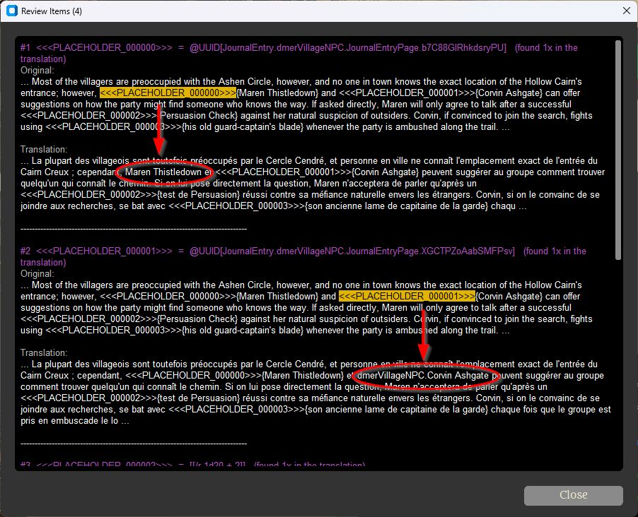

- This view is read-only — nothing gets fixed automatically here. Think of it as a todo list pointing you to
  exactly what needs manual attention.
- The same list is also saved as its own file in your output folder, alongside the translated file itself, so
  you can work through it at your own pace after the run finishes, without needing to reopen this dialog.

### 12. Reintegrating the Result into Foundry VTT

**Localization input** → CFBT's output lands at `<module>/lang/<language-code>.json`, exactly matching Foundry's
own module `lang/` folder convention. Drop it into the target module's `lang/` folder, and make sure that
language is listed in the module's `module.json`.

**Babele input** → CFBT's output lands at `<module>/babele/<language-code>/<module-name>.<compendium-name>.json`.
Babele itself expects `<your configured Translation Files Directory>/<language-code>/<module-name>.<compendium-name>.json`
— so copy just the contents *below* the `babele/` folder (the `<language-code>/` folders and their files) into
whatever directory you've set as Babele's **Translation Files Directory** (a world setting, configurable anywhere
under Foundry's Data folder). This only lines up correctly if your original input file was already named
`<module-name>.<compendium-name>.json` in the first place, matching Babele's own convention — CFBT preserves
that filename as-is.

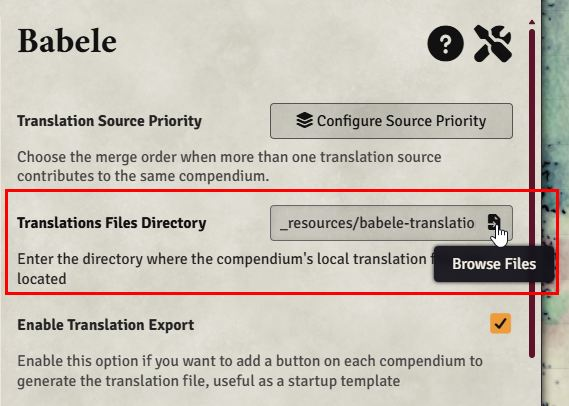

Either way: any `*-review-items.json` file needs to be worked through by hand first (see step 11) — Babele and
Foundry ignore it entirely, so once its fixes are applied to the corresponding translation file, it can be
deleted.

**The only manual step required (if any):**

- **Locate**: Compare "Review Items" and final translation side-by-side, identifying each pair of Review Item and related translation paragraph.
- **Replace**: Restore the missing text (Foundry Macro Syntax) in the translation with what's given under "original value"

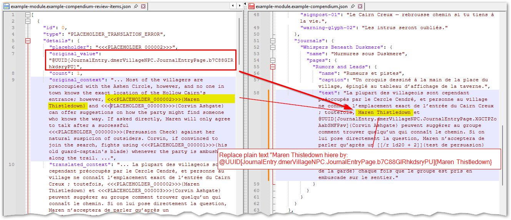

## A General Note on Translation Quality

**LLM output is inherently non-deterministic.** Running the exact same text through the same model twice in a
row will usually yield at least *some* differences. Feel encouraged to experiment — Max Batch Size, game
system/genre, even just re-running a batch can shift the result. It's ultimately a trade-off between chasing the
optimal translation and controlling API cost. In practice, AI translations tend to land around "~90% right" —
the rest is up to you: ignore it, or fix it by hand.

**CFBT recognizes translatable content by fixed rules.** It identifies what to translate inside a Babele-exported
JSON by a fixed set of field names and container names (see `TRANSLATABLE_FIELDS` / `TRANSLATABLE_CONTAINERS` in
the source). Given how many different mods and Babele output configurations exist, these fixed rules won't cover
every case — some content might not be recognized and stay untranslated. Making this configurable isn't
supported yet, but may come in a future CFBT version.

**Per-language quality varies, because so does my own testing.** I've done intensive QA for English → German (my
native language), somewhat less for English → French, only rudimentary checks for Spanish and Italian, and none
at all for Japanese. Feedback on any language is very welcome. The current language list is just a starting
point — I'm happy to extend it on request (please open a GitHub issue), but I'd rather not pre-add many languages
I have zero ability to judge myself, to avoid ending up with an unmaintainable mess.

## Advanced Features

### Using a Local LLM Server (e.g. Ollama)

Running a model locally via [Ollama](https://ollama.com/) means zero API cost and no data leaving your machine,
at the expense of needing capable hardware yourself and generally lower translation quality than top-tier hosted
models.

Quick start:

1. Install Ollama and pull a model, e.g. `ollama pull llama3.1`.
2. In CFBT's Settings, set **API Base URL** to `http://localhost:11434/v1`, set **LLM Model** to the model name
   you pulled, and enable **"No key needed"**.
3. Start translating — no API key, no per-request cost.

Since translation quality varies a lot between local models, review results carefully (see *A General Note on
Translation Quality* above) before relying on it for a large compendium.

The following, on the other hand, require running CFBT from Python source rather than the packaged build, since
they involve editing `cfbt_config.py` directly.

### Running CFBT from Source

1. Clone or download the repository.
2. Install dependencies: `pip install -r requirements.txt`.
3. Run it: `python cfbt.py`.

### Tweaking Translatable Fields & Containers

`TRANSLATABLE_FIELDS` and `TRANSLATABLE_CONTAINERS` (see *A General Note on Translation Quality* above) define
which JSON field and container names CFBT treats as translatable. If your input file uses field names these
fixed lists don't cover, extending them here is currently the only way to pick that content up.

### Tweaking Prompt Instructions

The exact instructions sent to the LLM live in `get_translation_instructions()` and
`get_terminology_instructions()` in `cfbt_config.py`. Editing these lets you fine-tune tone, style, or add
domain-specific guidance for the AI.

### Building Your Own Package

CFBT is packaged with PyInstaller via `cfbt.spec`. After installing dependencies, run `pyinstaller cfbt.spec` to
produce your own `--onedir` build in `dist/cfbt/`.

## Development Notes

This project was developed with substantial assistance from AI coding tools (Claude Code), used throughout for
architecture discussions, code generation, and documentation — including this README. All AI-assisted output was
reviewed, tested, and integrated by the author.

In my own words: *I did **not** have Claude generate this software from scratch to end: Instead, every single requirement, every architecture decision, every block of code have been discussed, reviewed, assembled intensively and interactively in chat mode, some parts being changed or extended by myself. So I consider this not some "automated robot output", but a robust result of AI-assisted pair programming. It was still (is continuing to be) a LOT of brainwork, challenge and fun, and I've learned a ton of good things from it!*