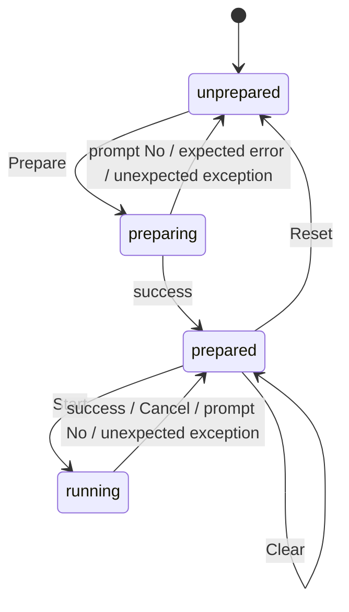

# State Diagram
(requires Mermaid plugin in IntelliJ)

**ASCII Version:**
```text
                 Prepare                  success
 [unprepared] ───────────► (preparing) ───────────► [prepared] ◄──────────┐
      ▲                        │                       │  │              │
      │  declined / error      │                       │  │ Start        │ any ending
      └────────────────────────┘                       │  ▼              │
      ▲                                                │ (running) ──────┘
      └──────────────────── Reset ─────────────────────┘
```
Square brackets are resting states, round brackets are phases.

# State Transition Table

| From | Event | Message | To |
|---|---|---|---|
| unprepared | Prepare clicked | | preparing |
| preparing | success | bars appear | prepared |
| preparing | prompt answered "No" (unusual name) | log | unprepared |
| preparing | expected input error (invalid file, `MAX_BATCH_SIZE`, nothing translatable) | hint dialog (OK) | unprepared |
| preparing | unexpected exception | error dialog | unprepared |
| prepared | Start clicked, API key missing | Settings dialog | prepared |
| prepared | Start clicked | | running |
| prepared | Reset clicked | | unprepared |
| prepared | Clear clicked, confirmed | bars refresh | prepared |
| prepared | Clear clicked, declined | | prepared |
| running | success | log | prepared |
| running | Cancel (also while a prompt is pending) | log | prepared |
| running | prompt answered "No" (integrity error) | log | prepared |
| running | unexpected exception | error dialog | prepared |

## "Stop after terminology" Workflow
See [Run Scenarios.xlsx](Run%20Scenarios.xlsx)